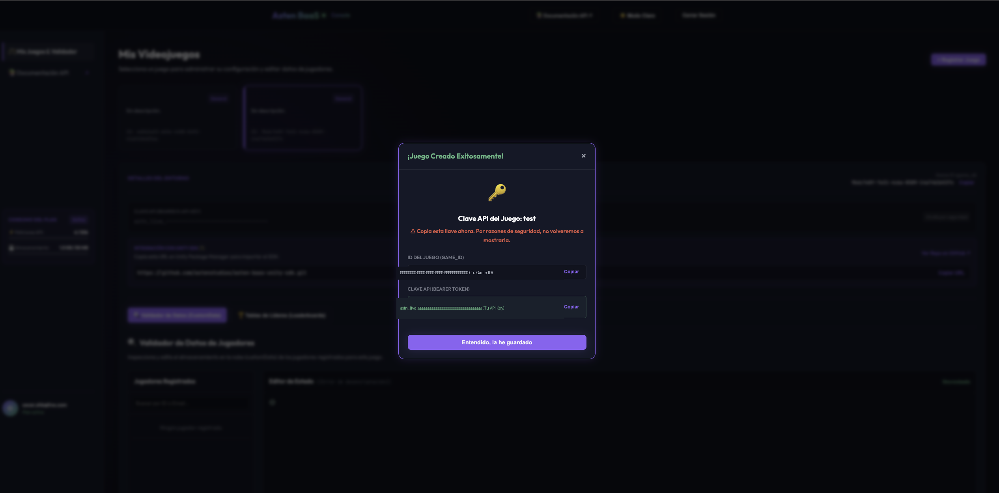
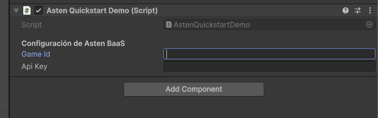

# 🚀 Asten BaaS Unity SDK (v1.0.1)

[](https://unity.com/)
[](https://docs.unity3d.com/Manual/Packages.html)
[]()
[](https://discord.gg/uttmKWfDNU)
[]()

The **official C# SDK** to connect your **Unity** games with **Asten BaaS** (Backend-as-a-Service) infrastructure. Designed for indie studios and professional developers who need secure authentication, cloud data persistence (Cloud Saves), and global leaderboards without managing servers or writing backend code.

---

## 🌟 Key Features

* ⚡ **Zero Server Configuration:** Forget about configuring databases, AWS APIs, or managing tokens; the SDK handles the entire cloud lifecycle.
* 🛡️ **Secure Hybrid Authentication:** Support for silent/anonymous login via **Device ID** and formal registration with **Email & 6-Digit OTP Verification**.
* 🧠 **Cloud Saves with Smart Debouncing:** Built-in save system with rate protection (3-second cooldown) to protect your game's FPS and prevent costly network spikes.
* 🏆 **Real-Time Global Leaderboards:** Submit scores, query competitive top rankings, and display medals (🥇🥈🥉) instantly.
* 🌐 **100% WebGL and Mobile Compatible:** Built on top of native, asynchronous `UnityWebRequest`. Works flawlessly in browser games (**itch.io, Poki, CrazyGames**), Android, iOS, PC, Mac, and Consoles without blocking the Main Thread.
* 📦 **Clean Isolation (`.asmdef`):** Zero console warnings and total compatibility with popular packages like TextMeshPro, Cinemachine, or Newtonsoft.Json.

---

## 👉 Asten BaaS Web Console & Credentials Setup

To start using this SDK in your Unity project, you need a **Game ID** and an **API Key**. You can generate and manage your entire cloud environment for free from our official console:

### 🔗 **[Asten BaaS Web Console](https://baas.astenstudios.com)**

### 🔑 Step-by-Step: How to get your credentials in 1 minute

1. **Sign Up or Log In:** Go to [baas.astenstudios.com](https://baas.astenstudios.com) and create your developer or studio account.
2. **Create a New Game:** In your main dashboard, click the **`+ Create`** button or select **New Game**.
3. **Enter Details:** Assign a name to your game (e.g., *My RPG Game*) and a short description. Click **Create**.
4. **Save Your Credentials Securely:** Once the game is successfully created, the console will show a popup with your two integration credentials:

   

   * **GAME ID (GAME_ID)**: The unique public identifier of your game (e.g., `9bdc7e8f-7e31-...`). Copy it using the **`Copy`** button.
   * **API KEY (BEARER TOKEN / API KEY)**: Your secret access key to authorize requests from Unity (e.g., `astn_live_df74...`).  
     > ⚠️ **SECURITY WARNING!** Copy and save it in a password manager or secure file immediately. For security reasons, the platform **will not show this secret key again** once you close the window.
5. You're set! With these two strings, you can initialize the SDK in Unity and bring your game to life.

---

## 📦 Unity Installation (3 Methods)

### Method 1: Unity Package Manager (Git URL - Recommended)
1. In the Unity Editor, open **Window** ➔ **Package Manager**.
2. Click the **`+`** button (top-left corner) and select **Add package from git URL...**
3. Paste the following official repository URL and click **Add**:
   ```text
   https://github.com/astenstudios/asten-baas-unity-sdk.git#v1.0.1
   ```
   *(Note: You can omit `#v1.0.1` to always download the latest development version).*

### Method 2: `.unitypackage` File (Asset Store / Direct Download)
1. Download the official package from the [Unity Asset Store]() or from the **Releases** section on GitHub.
2. In Unity, open **Assets** ➔ **Import Package** ➔ **Custom Package...** and select the `.unitypackage` file.

### Method 3: Git Submodule (For Advanced Developers)
If you want to modify the source code inside your own Git repository:
```bash
git submodule add https://github.com/astenstudios/asten-baas-unity-sdk.git Packages/com.astenstudios.baas
```

---

## 🕹️ Quickstart Demo Scene (1-Click Setup)

The SDK includes a code-driven interactive demo scene (`AstenQuickstartDemo.unity` & `AstenQuickstartDemo.cs`) located in `Samples/DemoScene`. **No Canvas setup, TextMeshPro installation, or prefab dragging required.**

You can open `AstenQuickstartDemo.unity` directly from `Assets/AstenBaaS/Samples/DemoScene/` to run and test all authentication, cloud save, and leaderboard features in 1 minute.

### ⚙️ How to configure credentials in the Demo

To connect the demo scene with your cloud databases, assign your **Game ID** and **API Key**:

1. In your **Project** window, navigate to:  
   👉 `Assets/Samples/Asten BaaS SDK/1.0.1/Demo Scene & UI Components/` and open **`SampleScene.unity`** (or any empty scene).
2. In your **Hierarchy** window, click the object with the demo script (or create an empty GameObject via `Right Click ➔ Create Empty` and name it `AstenDemo`).
3. **Drag and drop** the script file **`AstenQuickstartDemo.cs`** from the Project window into the **Inspector** panel of that object (or click `Add Component` and search for *Asten Quickstart Demo*).
4. In the component Inspector, you will see fields to enter your credentials:

   

5. Fill in the two required fields:
   * **Game Id**: Paste your game identifier (copy it from your dashboard in the [Asten BaaS Web Console](https://baas.astenstudios.com)).
   * **Api Key**: Paste your secret API Key for Sandbox or Production (e.g., `astn_live_...`).
6. Press **Play ▶️** in the Unity Editor and watch the visual console connect to the cloud.

### 🎮 Interactive Demo Tabs
When running **Play ▶️** with configured credentials, the control panel lets you interact with 3 real-time tabs:
* **`[ 🎨 Visual Profile ]`**: Displays your unique player ID, truncated JWT, cloud coins, and current level.
* **`[ 🏆 Top 5 Ranking ]`**: Live view of the global leaderboard with 1st, 2nd, and 3rd place medals.
* **`[ 💻 Technical JSON ]`**: Inspect raw server responses for technical debugging.

---

## 🛠️ Integration Guide

### 1. SDK Initialization
Before calling any authentication or save functions, initialize the `AstenSDK.Instance` singleton when your game starts (e.g., in a `GameManager.cs` script or your main loading scene):

```csharp
using UnityEngine;
using AstenBaaS;

public class GameManager : MonoBehaviour
{
    void Awake()
    {
        string gameId = "YOUR_GAME_ID_HERE";
        string apiKey = "astn_live_YOUR_API_KEY_HERE";
        
        // Optional: Specify custom server URL (defaults to Asten global cloud)
        string backendUrl = "https://api.baas.astenstudios.com";

        // Initialize Asten BaaS engine
        AstenSDK.Instance.Initialize(gameId, apiKey, backendUrl);
        Debug.Log("🚀 Asten SDK ready to use.");
    }
}
```

---

### 2. Player Authentication (`AstenSDK.Auth`)
The SDK manages session state transparently. Once authenticated, the **Player Session Token (JWT)** is stored in memory and injected into all HTTP headers automatically.

#### 🎮 Anonymous Login (Device ID - Recommended for Fast Onboarding)
Registers and logs in silently the first time a player opens your game:
```csharp
AstenSDK.Instance.LoginWithDeviceId((success, response) =>
{
    if (success)
    {
        Debug.Log($"✅ Guest session active. Player ID: {AstenSDK.Instance.ActivePlayerId}");
    }
    else
    {
        Debug.LogError($"❌ Guest login failed: {response}");
    }
});
```

#### 📧 Account Registration and 6-Digit OTP Verification
To prevent fake accounts or spam, our backend sends a 6-digit OTP security code to the user's email upon registration:
```csharp
// 1. Request registration (sends an email with a 6-digit code to the user)
AstenSDK.Instance.RegisterPlayer("player@studio.com", "mySecurePassword123!", (success, response) =>
{
    if (success)
    {
        Debug.Log("📬 Registration created. Please check your email for the verification code.");
    }
});

// 2. Verify OTP code (activates account and logs in immediately)
string otpCode = "123456"; // Code entered by the player in an InputField
AstenSDK.Instance.VerifyPlayerEmail("player@studio.com", otpCode, (success, response) =>
{
    if (success)
    {
        Debug.Log($"✅ Email verified! Session active. JWT: {AstenSDK.Instance.PlayerSessionToken}");
    }
});
```

#### 🔑 Classic Login with Email and Password
For returning players logging in from another device or previously logged out:
```csharp
AstenSDK.Instance.LoginPlayer("player@studio.com", "mySecurePassword123!", (success, response) =>
{
    if (success)
    {
        Debug.Log("✅ Welcome back!");
    }
});
```

#### 🚪 Log Out
```csharp
AstenSDK.Instance.Logout(); // Clears Player ID and JWT Token from memory
```

---

### 3. Cloud Data Persistence (`AstenSDK.CloudSaves`)

Asten BaaS allows you to serialize and save any C# class or struct to MongoDB Atlas using `JsonUtility`.

> **💡 Built-in Debounce Protection (3-Second Cooldown):**  
> If your game code calls `SavePlayerData()` in a rapid loop (e.g., picking up coins in a level), **the SDK intelligently queues the request** and waits for 3 seconds of inactivity before sending it over the network. This guarantees peak performance at 60+ FPS without stuttering or saturating your server quota.

#### 💾 Save Player Progress
```csharp
[System.Serializable]
public class SaveData
{
    public int currentLevel;
    public int cloudCoins;
    public string equippedWeapon;
    public float[] lastCheckpointPosition;
}

public void SaveToCloud()
{
    SaveData myData = new SaveData
    {
        currentLevel = 15,
        cloudCoins = 2500,
        equippedWeapon = "Excalibur Sword",
        lastCheckpointPosition = new float[] { 10.5f, 2.0f, -4.3f }
    };

    AstenSDK.Instance.SavePlayerData(myData, (success, response) =>
    {
        if (success)
        {
            Debug.Log("☁️ Progress saved successfully to MongoDB Atlas.");
        }
        else
        {
            Debug.LogWarning("⏳ Error or request debounced (cooling down): " + response);
        }
    });
}
```

#### 📥 Load Progress from Cloud
```csharp
public void LoadFromCloud()
{
    AstenSDK.Instance.LoadPlayerData((success, jsonResponse) =>
    {
        if (success)
        {
            Debug.Log("☁️ Downloaded JSON: " + jsonResponse);
            
            // Deserialize back to C# class
            SaveData loadedData = JsonUtility.FromJson<SaveData>(jsonResponse);
            Debug.Log($"Retrieved coins: {loadedData.cloudCoins}");
        }
        else
        {
            Debug.LogError("❌ Failed to download save data: " + jsonResponse);
        }
    });
}
```

---

### 4. Global Leaderboards (`AstenSDK.Leaderboards`)

Create competitions, manage high scores, and display live rankings on any platform.
> **Backend Note:** By default, creating a new game in the Asten BaaS portal automatically generates a main leaderboard with the ID: **`"leaderboard_score"`**. You can create custom leaderboards (e.g., `"ranking_pvp"`, `"time_attack"`) from the web console.

#### 🏆 Submit a Score
The server features native **High Score** protection: it will only overwrite the score in the database if the new value is higher than the player's previous record.
```csharp
string leaderboardId = "leaderboard_score"; // Leaderboard ID in your console
int score = 9850;
string displayName = "ProGamer_2026";

AstenSDK.Instance.SubmitScore(leaderboardId, score, displayName, (success, response) =>
{
    if (success)
    {
        Debug.Log("🏆 Score evaluated and posted to global leaderboard!");
    }
});
```

#### 🥇 Get Top Ranking
Download the descending list of top players to render in your UI:
```csharp
int topLimit = 10; // Top 10 players

AstenSDK.Instance.GetTopScores("leaderboard_score", topLimit, (success, jsonResponse) =>
{
    if (success)
    {
        Debug.Log("📊 Top Ranking received: " + jsonResponse);
        // You can iterate over scores and render them with medals in your UI
    }
});
```

---

## 🔍 Real-Time State Inspection (Public Properties)
At any point during game execution, you can check public session properties to verify connection status:
```csharp
// Check if player is logged in
if (AstenSDK.Instance.IsLoggedIn)
{
    string playerId = AstenSDK.Instance.ActivePlayerId;     // MongoDB UUID
    string jwtToken = AstenSDK.Instance.PlayerSessionToken; // Active security token
    Debug.Log($"Logged in player ID: {playerId}");
}
```

---

## 🏛️ Architecture & Best Practices

1. **Main Thread Unblocking:** All network operations are encapsulated in optimized asynchronous coroutines using `UnityWebRequest`. Under heavy stress testing, the SDK maintains **300+ FPS** stability with zero aggressive garbage collection (Zero-Allocation practices).
2. **WebGL Compatibility:** By avoiding heavy web sockets or direct `System.Net.Sockets` dependencies, the SDK is ideal for HTML5/WebGL builds.
3. **Resilient Error Handling (Offline/No-WiFi):** If internet connection is lost or the server returns an HTTP error (`400 Bad Request`, `401 Unauthorized`), the SDK captures the exception cleanly and invokes your callback with a user-readable error message without crashing the game or throwing uncaught console exceptions.

---

## 💬 Community, Support & Contributions

* 💬 **Official Discord Server**: Join our active developer community, ask technical questions, and share your games at:  
  👉 **[https://discord.gg/uttmKWfDNU](https://discord.gg/uttmKWfDNU)**
* 📧 **Direct Technical Support**: Email us at **support@astenstudios.com** for 1-on-1 assistance or integration issues.
* 🌐 **Web Platform**: [https://baas.astenstudios.com](https://baas.astenstudios.com)
* 🐛 **Bug Reports & Issues**: Open an [Issue on GitHub](https://github.com/astenstudios/asten-baas-unity-sdk/issues) or reach out on Discord.

---

<p align="center">
  <b>Asten Studios © 2026</b><br>
  <i>Next-generation backend infrastructure for Unity games.</i>
</p>
